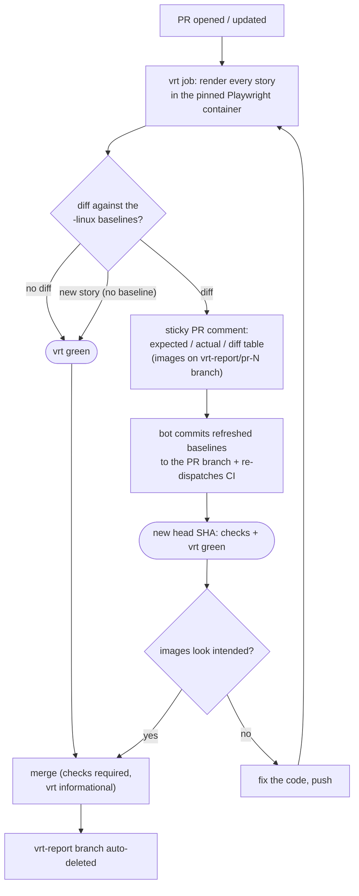

# @katsu5012/ui

React UI component library built with [Base UI](https://base-ui.com) and [Tailwind CSS v4](https://tailwindcss.com), documented with [Storybook](https://storybook.js.org) and visually tested with [Vitest browser mode](https://vitest.dev/guide/browser/).

## Development

```sh
pnpm install
pnpm exec playwright install chromium  # first time only, for VRT
pnpm storybook                          # dev server at http://localhost:6006
```

## Scripts

| Script                 | Description                                                                       |
| ---------------------- | --------------------------------------------------------------------------------- |
| `pnpm storybook`       | Start Storybook dev server                                                        |
| `pnpm build-storybook` | Build static Storybook into `storybook-static/`                                   |
| `pnpm test:vrt`        | Run visual regression tests (headless Chromium, self-contained)                   |
| `pnpm test:vrt:update` | Update VRT baseline screenshots                                                   |
| `pnpm typecheck`       | Type-check with `tsc --noEmit`                                                    |
| `pnpm build`           | Build the library into `dist/` (ESM + CJS + type declarations, via Vite lib mode) |

## Visual regression testing

VRT is implemented with `@storybook/addon-vitest`: every story runs as a Vitest browser-mode test in headless Chromium, and an `afterEach` hook in `.storybook/vitest.setup.ts` screenshots the rendered story and compares it against the baseline via Vitest's `toMatchScreenshot`.

### Operating model



The single source of truth is the CI-rendered baseline set:

1. **Only `-linux.png` baselines are committed**, rendered inside the pinned Playwright container (`mcr.microsoft.com/playwright:v<playwright version>-noble`), and **only the "VRT Update Baselines" workflow bot may write them**. The required `checks` job rejects any PR where `__screenshots__/` was touched by a commit not authored by `github-actions[bot]`, so images rendered on a dev machine can never merge.
2. **Locally rendered `-darwin.png` baselines are gitignored scratch files.** Your first `pnpm test:vrt` bootstraps them automatically; from then on they catch regressions during local development. Never commit them.
3. On a PR, the `vrt` job compares against the committed baselines. No diff → green.
4. **On a diff, the PR gets a sticky comment** with an expected / actual / diff image table (images are pushed to a `vrt-report/pr-<n>` branch, deleted automatically when the PR closes), and **the bot immediately commits the refreshed baselines to the PR branch** and re-dispatches CI so the new head SHA gets its required checks.
5. Review the images in the comment (the baseline changes are also visible as changed PNGs in Files changed). Intended → merge; merging is what accepts the new baselines. Unintended → fix the code and push (baselines refresh automatically again).
6. **New components and new stories never fail VRT**: a missing baseline is created on the spot instead of erroring (see `.storybook/vitest.setup.ts`); their CI baselines are auto-committed the same way.

The `vrt-update` workflow remains as a manual escape hatch (dispatch it on a branch to regenerate all baselines, e.g. after bumping the Playwright image).

- Baseline layout: `__screenshots__/<component>/<Story>-chromium-<platform>.png` at the repo root, defined by `resolveScreenshotPath` in `vitest.config.ts`.
- When bumping the `playwright` package, update the container image tags in `ci.yml` and `vrt-update.yml` to match.
- On a failed comparison, the actual and diff images are written to `.vitest/attachments/` (gitignored).
- After an intentional visual change, run `pnpm test:vrt:update` and commit the updated baselines.
- Exclude a story from testing entirely with `tags: ['!test']` in the story or meta.

## Adding a component

1. Create `src/components/<name>/<name>.tsx`, `<name>.stories.tsx`, and `index.ts`.
2. Export it from `src/index.ts`.
3. Generate baselines for the new stories: `pnpm test:vrt:update`, then commit them.
